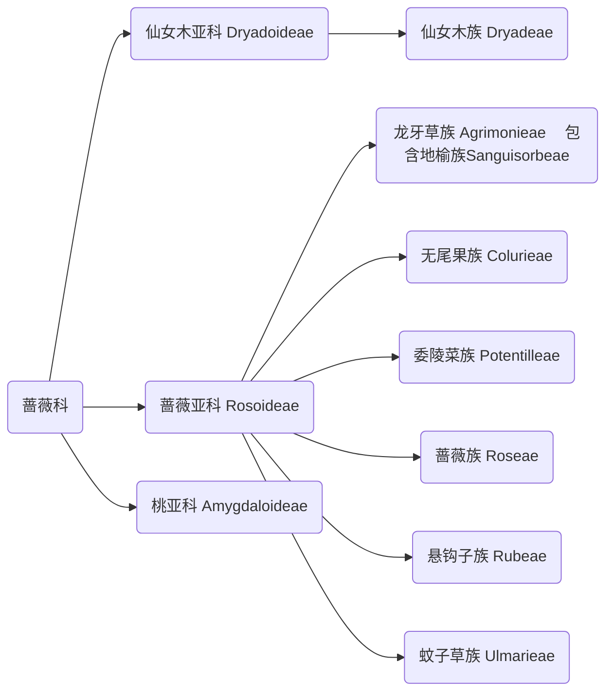

D-->桃族Amygdaleae
D-->白鹃梅族Exochordeae
D-->棣棠族Kerrieae
D-->苹果族Maleae（包含山楂族 Crataegeae、美吐根族 Gillenieae）
D-->绣线梅族Neillieae
D-->珍珠梅族Sorbarieae
D-->绣线菊族Spiraeeae

* 荨麻科 Urticaceae
* 桑科 Moraceae
	* 桑属 Morus
		* **桑树**
	* 桂木属 Artocarpus
  		* **菠萝蜜** *A. heterophyllus*
  		* **面包树** *A. altilis*
  	* 榕属 Ficus
  		* **无花果** *F. carica*
  		* **榕树** *F. microcarpa*
* 大麻科 Cannabaceae
	* 大麻属 Cannabis
		* **大麻**
* 榆科 Ulmaceae
* 钩毛树科 Barbeyaceae
* 八瓣果科 Dirachmaceae
* 胡颓子科 Elaeagnaceae
* 鼠李科 Rhamnaceae
	* 枣属 Ziziphus
		* **枣（原变种）** *Z. j. var. jujuba*
		* **无刺枣** *Z. j. var. inermis*
		* **酸枣** *Z. j. var. spinosa*
		* **冬枣** *Z. j. cv. Dongzao*
* 蔷薇科 Rosaceae
	* 草莓属 Fragaria
		* **草莓** *F. × ananassa*
	* 蔷薇属 Rosa
		* **玫瑰**
		* **月季** 
		* **蔷薇**
		* **缫丝花** *R. roxburghii* 又名刺梨花
	* 李属 Prunus
		* **桃** *P. persica*
		* **扁桃** *P. dulcis*
		* **李**
		* **杏** P. armeniaca
					® 紫叶李 P. cerasifera
					® 梅 P.mume
					® 榆叶梅 P. triloba
					® 麦李 P. glandulosa
					® 郁李 P. japonica
					® 樱桃
			§ 白鹃梅族 Exochordeae
			§ 棣棠族 Kerrieae
			§ 苹果族 Maleae（包含山楂族 Crataegeae、美吐根族 Gillenieae）
				□ 木瓜属 Pseudocydonia - 苹果亚族 Malinae
					§ 木瓜 P. sinensis
				□ 木瓜海棠属 Chaenomeles - 苹果亚族 Malinae
					§ 贴梗海棠 C. speciosa
				□ 苹果属 Malus - 苹果亚族 Malinae  
					§ 垂丝海棠 M. halliana
					§ 苹果 M. pumila
				□ 梨属 Pyrus - 苹果亚族 Malinae 
					§ 梨
				□ 山楂属 Crataegus - 山楂族 Crataegeae
					§ 山楂 C. pinnatifida
				□ 枇杷属 Eriobotrya - 苹果亚族 Malinae 
					§ 枇杷 E. japonica
				
			§ 绣线梅族 Neillieae
			§ 珍珠梅族 Sorbarieae
			§ 绣线菊族 Spiraeeae
